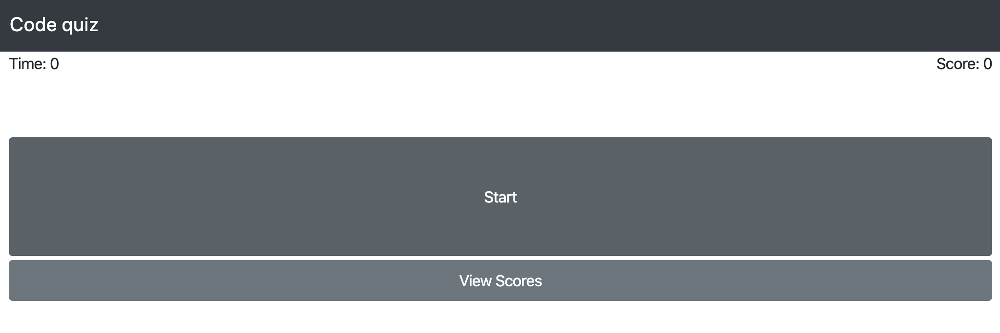
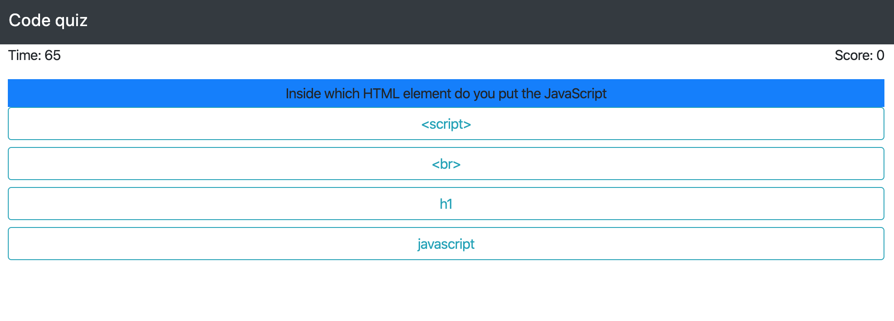
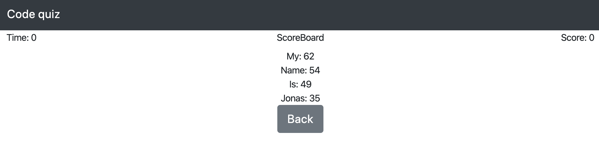

# theMagicalCodeQuiz

### Link to the deployed site

https://seanianking.github.io/theMagicalCodeQuiz/

## Contents

Below is a picture of the landing page:

When the quiz is running you will see this display for five questions:

When the quiz ends, you will be able to submit your score, which will save to local storage. That page looks like this: 

